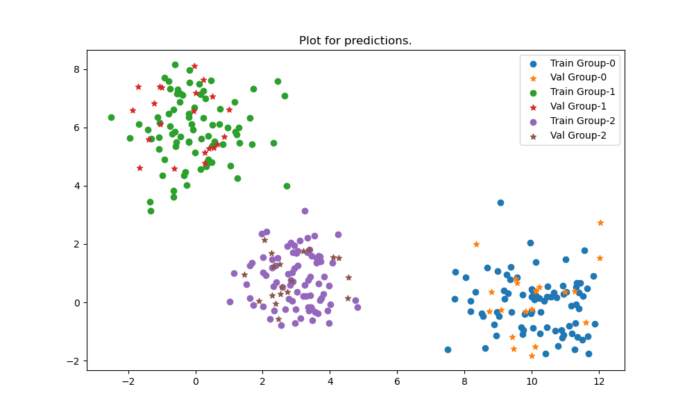

# Logistic Regression

A python implementation of logistic regression using just `numpy`. This was done
as a project to learn the math behind logistic regression.

Logistic Regression notes on
[suchicodes.com/u/csci-3151](https://suchicodes.com/u/csci-3151#logistic-regression)
contains the details of the math of this project. 

Here is an example of using this model to classify a synthetically generated
dataset:

 

## Dependencies

The project requires the following Python libraries:

- **NumPy** for numerical computations and data manipulation.
- **Matplotlib** for generating visualizations of the data clusters and
  classification results.

## Files

- `logistic_regression.py`: Contains the implementation of the logistic
  regression model.

- `graph.py`: Provides functions to visualize the data clusters and
  classification results.

- `main.py`: an example of using the model with some synthetic data.

## Usage

To run the project:

1. Ensure all dependencies are installed.

2. Run the main script to generate data, train the logistic regression model, and visualize the results:
    ```bash
    python main.py
    ```
    This will output the training and validation cluster visualizations,
    including the classification results.
